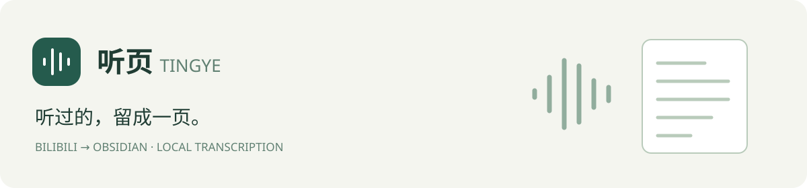
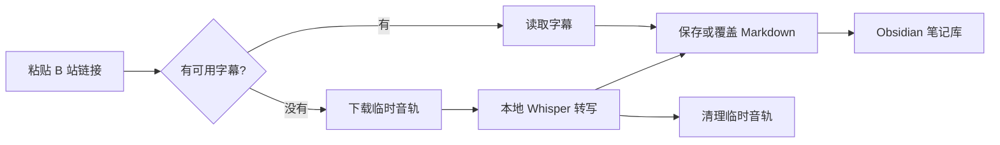

<p align="center">
  
</p>

<p align="center">
  <a href="https://github.com/LinkisLethe/tingye/actions/workflows/tests.yml"></a>
  <a href="https://www.python.org/downloads/"></a>
  
  <a href="https://obsidian.md/"></a>
  
</p>

<p align="center">中文 · <a href="README.en.md">English</a></p>

# 听页 Tingye

把 B 站视频保存成 Obsidian 中带时间戳的 Markdown 笔记。有可用字幕时直接收录，没有字幕时下载音轨，用本地语音识别模型转写。粘贴链接、选择笔记库，后续处理在后台完成。

听页由 **Python 本地服务与 HTML 网页界面**组成，无需大语言模型、API 密钥或 Obsidian 插件。直接双击 HTML 或部署到 GitHub Pages 无法运行转写功能。

## 可以做什么

- **批量收录**。支持视频链接、BV 号和分享文字，每行一条，一次最多 50 条。
- **缺字幕也能保存**。使用 faster-whisper 在本机识别音频，支持自动语言、中英文和术语提示。
- **直接写入笔记库**。保存视频信息、内嵌播放器、原视频简介和带时间戳的文字。
- **同一视频只留一份**。同一 BV 号与分 P 再次收录时覆盖旧笔记，清理所选目录内匹配的额外副本。
- **音轨用完清理**。笔记库中只保存 Markdown，不生成音频、TXT、SRT 或 JSON 附件。
- **队列可恢复**。支持取消、失败重试和中断恢复，关闭网页后后台继续处理。



## 开始使用

需要 **Windows、Python 3.11 或更新版本，以及一个已有的 Obsidian 笔记库**。安装 Python 时勾选加入 PATH；笔记库需已由 Obsidian 打开过，包含 `.obsidian` 文件夹。

1. 选择仓库页面的 **Code → Download ZIP** 并解压，或克隆仓库。
2. 双击 `启动听页.vbs`。首次启动会准备 Python 环境并安装依赖，可能需要几分钟。
3. 浏览器打开 [本地听页](http://127.0.0.1:18761)，选择笔记库和保存子文件夹。
4. 粘贴链接，每行一条，点击 **开始收录**。

默认保存到笔记库中的 `Clippings/Bilibili`。首次执行语音转写还需要下载模型，请保留网络连接。

如果 Windows 禁用了 VBS，在项目文件夹中运行下面的命令。

```powershell
powershell -ExecutionPolicy Bypass -File .\launch.ps1
```

也可以指定 Python 可执行文件。

```powershell
.\launch.ps1 -Python 'C:\path\to\python.exe'
```

## 笔记怎样保存

文件名采用 `日期-视频标题.md`，格式参照 Bilibili Clipper 的剪藏笔记。正文包含“简介”和“字幕”，时间戳使用反引号包裹，例如 `00:42`。简介来自视频说明，程序不生成摘要。

**重复收录会替换整篇旧笔记，包括手动补充的正文。**覆盖前的 Markdown 会备份到笔记库外的 `~/.tingye/backups/overwritten-notes`，建议把自己的阅读笔记另存为文件。

匹配依据是笔记开头的 BV 号或视频链接，以及分 P 编号。程序递归检查所选保存目录，不会因为正文提到其他视频就删除该笔记；不同分 P 分别保存。

## 转写与数据位置

| 选项 | 说明 |
| --- | --- |
| `large-v3-turbo` | 默认模型，首次下载约 1.6 GB |
| `small` | 较轻量，首次下载约 0.5 GB |
| 自动语言 | 可用于中英混合语音，也可指定中文或英语 |
| 术语提示 | 提供专有名词作为识别参考，不保证每次正确 |
| 处理线程 | 调低可减少 CPU 占用，处理时间可能增加 |

网页提交的任务默认使用本机 CPU。已有字幕不需要下载语音模型。模型准备好后，音频识别可在本机离线执行；获取 B 站视频、字幕和内嵌播放器仍需要联网。

| 内容 | 默认位置 |
| --- | --- |
| Markdown 笔记 | 用户选择的 Obsidian 文件夹 |
| 设置、队列、日志、临时文件和独立 Python 环境 | `~/.tingye` |
| 覆盖前的旧笔记备份 | `~/.tingye/backups/overwritten-notes` |
| 语音模型 | 用户的 Hugging Face 缓存目录 |

服务仅监听 `127.0.0.1`，校验本地请求来源。程序不自动读取浏览器登录信息，也不向大语言模型服务发送音频或转写内容。

## 当前限制

- 主要支持可公开访问的 B 站视频。登录、地区、付费限制或平台接口变化可能导致获取失败。
- 语音转写可能有错词、漏词和断句问题。程序会对部分疑似漏转片段做有限补转，但不会看画面核对或生成内容总结。
- Windows 是当前主要使用和测试平台。仓库包含 Linux GPU 执行组件，尚未提供网页中的一键远端部署。
- 听页目前独立运行，尚未与 Bilibili Obsidian Clipper 合并。

## 开发

```powershell
git clone https://github.com/LinkisLethe/tingye.git
cd tingye
python -m venv .venv
.\.venv\Scripts\python.exe -m pip install -r requirements.txt
.\.venv\Scripts\python.exe -m unittest discover -s tests -v
.\.venv\Scripts\python.exe -m app.server --no-browser
```

`requirements.txt` 固定直接依赖版本，`requirements.lock.txt` 记录已验证环境的完整依赖快照。测试使用临时笔记库与模拟媒体响应，不下载真实视频或模型，也不评估转写准确率。检查范围见 [VALIDATION.md](VALIDATION.md)。

```text
app/
├── static/          HTML、CSS 和 JavaScript 界面
├── server.py        本地 HTTP 服务和队列管理
├── media.py         B 站资料、字幕和音轨获取
├── asr.py           本地语音识别与有限补转
├── exporter.py      Markdown 保存、覆盖和备份
└── remote_*.py      可选的 SSH GPU 执行组件
tests/               自动化回归测试
launch.ps1           Windows 环境准备与启动
```

接口与保存约定见 [CONTRACT.md](CONTRACT.md)。远端组件需要自行配置 SSH、Linux Python 环境、`requirements-gpu.txt`、模型和批次清单，通过 `python -m app.remote_bridge --manifest <清单路径>` 运行。它是开发者入口，普通网页任务仍在本机执行。

## 使用的项目

语音识别基于 [faster-whisper](https://github.com/SYSTRAN/faster-whisper) 与 [Whisper](https://github.com/openai/whisper)，推理由 [CTranslate2](https://github.com/OpenNMT/CTranslate2) 执行。模型下载使用 [Hugging Face Hub](https://github.com/huggingface/huggingface_hub)，网络请求使用 [HTTPX](https://github.com/encode/httpx)，中文转换使用 [OpenCC Python](https://github.com/yichen0831/opencc-python)。
